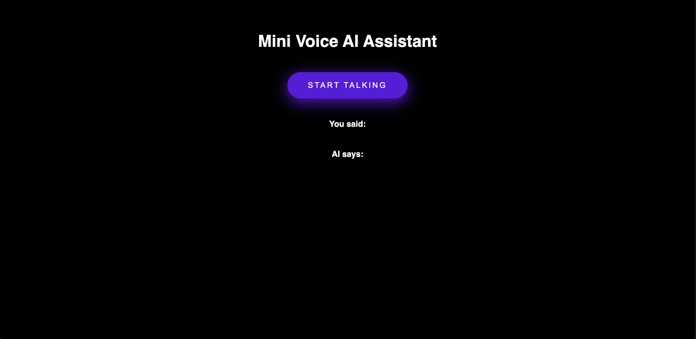
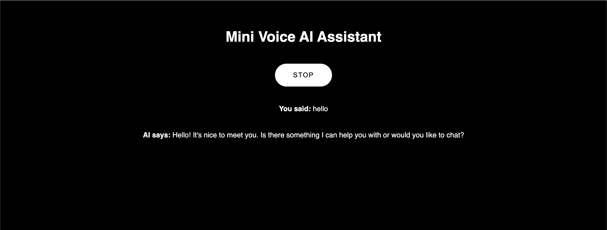

# Mini Voice AI Assistant

A browser-based voice assistant that listens to your speech, processes it using Groq's `compound-beta` large language model (LLM), and speaks the AI’s response back to you.

**Assisted by ChatGPT AI** – This project was created and refined with help from ChatGPT to demonstrate a working voice assistant using Groq, HTML, JavaScript, and browser-native speech capabilities.

---

## Preview

---

## Tech Stack

- **HTML** – App layout and UI
- **CSS** – Basic styling
- **JavaScript** – Handles voice recording, API calls, and speaking
- **Groq API** – Handles the AI response generation (`compound-beta` model)
- **Web APIs** – Uses `SpeechRecognition` and `SpeechSynthesis` from the browser

---
## Setup Instructions (VS Code)
### 1. Open Project in VS Code
### 2. Add the HTML File

Make sure it includes:
- Microphone recording
- API interaction with Groq
- Text-to-speech output
- Toggle button logic
3. Install Live Server (Optional but Recommended)
Install the Live Server extension to preview your HTML file in the browser with one click.

Steps:
- Go to Extensions panel in VS Code (Ctrl+Shift+X or Cmd+Shift+X)
- Search "Live Server"
- Click Install

To launch:

Right-click index.html → Open with Live Server

### 4. Get a Groq API Key
Sign up or log in at https://console.groq.com
- Go to your API Keys
- Click Create API Key
- Copy the key

### 5. Insert Your API Key

In index.html, find this line: const apiKey = "";

Replace with: const apiKey = "your-groq-api-key-here";

## Groq API Details

Endpoint: 

POST https://api.groq.com/openai/v1/chat/completions

## How It Works

1. Start Talking: Click the button and speak into your mic.

2. Transcribe: The browser converts your voice to text.

3. Send to Groq: Your text is sent to the compound-beta model via Groq’s API.

4. AI Responds: The assistant’s reply is spoken back using Text-to-Speech.

5. The button automatically toggles to show “Listening...”, “Thinking...”, or “Speaking...” based on state.

## Features
🎙 Voice recording with browser’s SpeechRecognition

💬 AI conversation using Groq LLM

🗣 Natural-sounding replies with SpeechSynthesis

🔁 One-button toggle to manage talk/listen states

## Credits

Created by Juan Espinoza

Assisted by ChatGPT AI – for brainstorming, building, and debugging the voice assistant logic.

## License
MIT License – Free to use, modify, and share.

## Questions?
Feel free to open an issue, connect on GitHub, or extend this for fun or educational use!

